# 🛡️ BhuRakshak — National Multi-Hazard Red Zone Identification & Relocation Decision Platform

> **Statutory AI Decision Support System for Ministry of Home Affairs (MHA), National Disaster Management Authority (NDMA), and Uttarakhand State Disaster Management Authority (USDMA)**  
> *Grounded in Sections 30 & 34 of the Disaster Management Act 2005 and NDMA Hilly Terrain Resettlement Guidelines.*

<p align="center">
  
  
  
  
  
</p>

---

## 🎯 Official Problem Statement

**Title**: *Intelligent Identification of Hazard-Based Red Zones, Carrying Capacity Assessment, and Immediate Relocation Needs for Vulnerable Habitations*

- **Background**: India’s disaster-prone regions face recurring hazards such as landslides, flash floods, and cloudbursts. Vulnerable habitations often remain in unsafe zones, leading to repeated loss of lives and property. Current relocation efforts are largely reactive, initiated after disasters strike, rather than proactively planned.
- **Description**: An intelligent, GIS-enabled decision support platform that dynamically identifies and updates multi-hazard Red Zones (areas unsuitable for permanent habitation), assesses the carrying capacity of safer alternative sites, and prioritizes vulnerable habitations for relocation. The system integrates hazard intensity, population vulnerability, and disaster history to guide evidence-based decisions.
- **Expected Solution**: A robust, AI-driven GIS platform that:
  1. Maps and updates hazard-based Red Zones in real-time.
  2. Assesses suitability and carrying capacity of safer relocation sites.
  3. Prioritizes vulnerable habitations for **Immediate (<30 days)**, **Short-Term (1–6 months)**, and **Medium-Term (6–24 months)** relocation.
  4. Provides actionable insights and legal executive relocation orders to State Disaster Management Authorities for proactive planning.

---

## 🏛️ System Architecture

```mermaid
graph TD
    subgraph MultiHazardInputs ["1. Multi-Hazard Geospatial Inputs"]
        DEM["NASA SRTM 30m DEM<br/>(Slope, Curvature, TWI)"]
        Hydro["WWF HydroSHEDS / HydroRIVERS<br/>(979 River Reach Vectors)"]
        GADM["GADM 4.1 Admin Boundaries<br/>(Tehsil & District Polygons)"]
        IMD["IMD Real-Time Weather<br/>(API-9 AWS/ARG, API-6 Warnings, API-10 QPF)"]
        USGS["USGS Real-Time Seismic<br/>(Himalayan Thrust Fault Acceleration kh)"]
        Hist["Historical Disaster Scar Inventory<br/>(12 Verified Ground-Truth Events)"]
    end

    subgraph CoreAIEngine ["2. THRIVE 3.2 Multi-Hazard Fusion Engine"]
        Phys["Mohr-Coulomb Infinite Slope Stability<br/>(Factor of Safety FS Bound)"]
        Orog["Orographic Cloudburst Funneling Index<br/>(1,500m - 2,800m Catchment Trapping)"]
        ML["Ground-Truth Trained XGBoost<br/>(Spatial Cross-Validation, AUC 0.90+)"]
        AHP["Eigenvector Analytic Hierarchy Process<br/>(Consistency Ratio CR < 0.08)"]
    end

    subgraph DecisionPillars ["3. Executive Operational Pillars"]
        RedZones["Dynamic Multi-Hazard Red Zones<br/>(Real-Time Spatial Contour Dilation)"]
        Capacity["NDMA Carrying Capacity Headroom Ledger<br/>(70 LPCD Water, <14° Slope, PMGSY Road Link)"]
        Prioritization["Tri-Tier Relocation Priority Matrix<br/>(Immediate, Short-Term, Medium-Term)"]
    end

    subgraph CommandConsole ["4. MHA / NDMA Crisis Command Console"]
        Console["State & District Operations Deck<br/>(National Threat Alert Badge, Scenarios, Dijkstra Trails)"]
        Manifest["Executive Relocation Order & Manifest<br/>(SDRF ₹7.0L/Household Package, PDF Export)"]
        Continuous["Continuous Learning Feedback Loop<br/>(DEOC / SDRF Field Ground-Truth Ingestion)"]
    end

    MultiHazardInputs --> CoreAIEngine
    CoreAIEngine --> DecisionPillars
    DecisionPillars --> CommandConsole
```



---

## 🔬 Core Innovations ("Thinking Out of the Box")

### 1. THRIVE™ 3.2 — Multi-Hazard Fusion Formulation
Unlike simplistic single-hazard approaches, THRIVE unifies 5 orthogonal spatial dimensions into a single defensible probability field:

$$\text{THRIVE}(x) = \alpha \cdot P(\text{Landslide}) + \beta \cdot P(\text{Flood}) + \gamma \cdot P(\text{Cloudburst}) + \delta \cdot V(\text{Vulnerability}) + \epsilon \cdot H(\text{Recurrence})$$

- **Physics-Constrained ML**: Mohr-Coulomb Infinite Slope Stability governs the ML output. If the geotechnical Factor of Safety $FS > 2.5$, landslide probability is bounded $\le 0.10$; if $FS < 1.0$ (active shear failure), probability is floored at $\ge 0.75$, preventing catastrophic false negatives.
- **Orographic Cloudburst Funneling**: Mountain valleys between 1,500m and 2,800m elevation funnel south-facing monsoon plumes, triggering sudden deluge cells (e.g. Asi Ganga 2012, Dharali 2025).
- **Spatial Cross-Validation**: Spatial block splitting across latitude bands prevents autocorrelation data leakage between training and testing sets.

### 2. Dynamic Real-Time Red Zone Delineation
Hazard-based Red Zones are not static pins—they are continuous spatial polygons representing areas strictly unsuitable for permanent human habitation:
- When rainfall intensity spikes ($>50\text{ mm/hr}$), soil saturation climbs ($>75\%$), or seismic shaking hits ($k_h > 0.15\text{g}$), the platform recomputes the multi-hazard field in real-time.
- Generates real-time GeoJSON polygon contours (`/api/hazard-zones/dynamic`) that dynamically expand, highlighting newly endangered habitations and population at imminent risk.

### 3. NDMA Carrying Capacity Assessment Engine
Safe alternative sites (Green Zones) are rigorously evaluated against official National Disaster Management Authority (NDMA) hill habitat resettlement norms:
1. **Topographical Terrace Stability**: Slope strictly $< 14^\circ$ (ideally $3^\circ - 8^\circ$ buildable river terrace), outside active debris flow runout paths.
2. **Floodplain Safety Buffer**: $> 300\text{ m}$ lateral buffer from Strahler Order 4–5 rivers (Bhagirathi/Yamuna) and elevated above the 100-year flood line.
3. **Potable Water Security**: Perennial spring or gravity-fed intake within $500\text{ m}$ delivering minimum **70 Litres Per Capita per Day (LPCD)**.
4. **All-Weather Road Connectivity**: Maximum $1.5\text{ km}$ distance to PMGSY (Pradhan Mantri Gram Sadak Yojana) or BRO all-weather highway.
5. **Active Headroom Ledger & Overflow Redistribution**:
   $$\text{Remaining Headroom} = \text{Total Carrying Capacity} - \sum \text{Allocated Habitation Population}$$
   If any safe site exceeds $85\%$ capacity, it enters `CAPACITY_STRESSED`; if it hits $100\%$, the system automatically redistributes overflow population to the nearest secondary safe zone within $15\text{ km}$.

### 4. Tri-Tier Relocation Prioritization Matrix
Habitations are categorized into statutory urgency tiers with defensible mathematical formulas:

$$\text{Relocation Priority Index (RPI)} = 0.45 \cdot I_{\text{Hazard}} + 0.30 \cdot V_{\text{Population}} + 0.25 \cdot H_{\text{Recurrence}}$$

| Urgency Tier | Horizon | Criteria | Statutory Directive (DM Act 2005) | SDRF Budget Norm |
|---|---|---|---|---|
| **Tier 1: Immediate** | **< 30 Days** | Red Zone, $FS < 1.0$, Slope $>28^\circ$, or $<2\text{ km}$ from major disaster scar | Mandatory pre-monsoon evacuation under **Sec 30 & 34**; emergency staging at Safe Sites Alpha-1 to Alpha-10 | Transit camp setup + ₹7.0L permanent homestead grant |
| **Tier 2: Short-Term** | **1–6 Months** | Orange Zone / transitional Red Zone buffer with high population exposure | Topographical cadastral demarcation of permanent terrace plots | SDRF Phase-1 rehabilitation assistance |
| **Tier 3: Medium-Term** | **6–24 Months** | Moderate hazard Yellow/Orange zones requiring structural mitigation | Bio-engineering slope retaining walls & planned voluntary resettlement under PMAY-G | Community infrastructure (water, road, clinic) |

---

## 📊 Uttarkashi District Baseline Metrics

| Metric | Ground-Truth Value |
|---|---|
| **Total Surveyed Habitations** | 178 Habitations |
| **Total Surveyed Population** | 135,837 Citizens |
| **Multi-Hazard Red Zone Habitations** | 26 Habitations |
| **Orange Zone Buffer Habitations** | 32 Habitations |
| **Population Requiring Relocation** | 61,897 Citizens (11,903 Families) |
| **Immediate Evacuation Habitations (<30d)** | 22 Habitations |
| **Verified Safe Relocation Sites** | 130 Sites (Terraces Alpha-1 to Alpha-130) |
| **Total District Safe Carrying Capacity** | 471,956 Citizens |
| **Net Regional Capacity Surplus** | **+410,059 Headroom Buffer** |
| **Estimated SDRF Rehabilitation Package** | **₹43.33 Crores** (at ₹7.0 Lakhs/Family) |
| **Historical Disaster Spatial Hit Rate** | **100.0% (12 / 12 verified events matched)** |

---

## ⚡ Quickstart & Operational Commands

### Prerequisites
- Python 3.9+ (`fastapi`, `uvicorn`, `numpy`, `scipy`, `sklearn`, `xgboost`, `rasterio`, `geopandas`, `shapely`)
- Node.js 18+

### 1. Run Automated Test Suite
```bash
python3 -m unittest backend/tests/test_platform.py
```
*All 16 unit tests validate dynamic triggers, Mohr-Coulomb physics, Dijkstra trails, carrying capacity ledger, and REST API endpoints.*

### 2. Start FastAPI Intelligence Backend
```bash
python3 -m uvicorn backend.main:app --host 0.0.0.0 --port 8000
```
Backend runs on **http://localhost:8000** with interactive Swagger documentation at **http://localhost:8000/docs**.

### 3. Build & Launch Executive Frontend
```bash
cd frontend
npm install
npm run dev
```
Open **http://localhost:5173** in your browser to access the 3D Command Console.

---

## 📡 REST API Specification

| Endpoint | Method | Description |
|---|---|---|
| `/api/summary` | GET | Aggregated district risk statistics & relocation summaries |
| `/api/hazard-zones` | GET | Baseline Multi-Hazard Red, Orange, Yellow, Green polygons |
| `/api/hazard-zones/dynamic` | GET | Real-time dynamically expanded polygon Red Zones under current triggers |
| `/api/hazard-grid` | GET | High-resolution 30m hazard probability terrain grid |
| `/api/safe-zones` | GET | AHP-ranked safe alternative relocation sites with carrying capacity |
| `/api/carrying-capacity/ledger` | GET | Detailed site-by-site carrying capacity status, allocated villages, and stress tier |
| `/api/relocation-priorities` | GET | Tri-tier prioritized habitation matrix with statutory legal directives |
| `/api/dm-action-plan` | GET | Official MHA/USDMA Executive Decision Brief & SDRF budget allocation breakdown |
| `/api/simulate` | POST | Dynamic multi-hazard simulation accepting rainfall, saturation, and seismic $k_h$ |
| `/api/simulate/flow` | GET | 3D Voellmy debris torrent runout and river flood inundation buffer |
| `/api/simulate/evacuation-routes` | POST | Dijkstra least-cost valley evacuation trail vectors connecting to safe sites |
| `/api/imd/live-telemetry` | GET | Real-time AWS/ARG automated weather station readings |
| `/api/stream/alerts` | GET | Server-Sent Events (SSE) live telemetry stream broadcast |

---

## 📜 Statutory Mandate & Legal Framework

This platform implements the legal directives of:
1. **Disaster Management Act 2005 (Act No. 53 of 2005)**:
   - **Section 30(2)(iii)**: Powers of District Authority to examine vulnerability of different parts of the district.
   - **Section 34(b)**: Powers of District Authority to direct removal of persons from vulnerable zones.
2. **National Disaster Management Guidelines (NDMA)**: Management of Landslides and Snow Avalanches (2009) & Habitat Relocation Protocol (2018).
3. **State Disaster Response Fund (SDRF)**: Revised Rehabilitation and Reconstruction Norms for Special Category Himalayan States.

---

*Authored for the Ministry of Home Affairs, Government of India & USDMA.*
